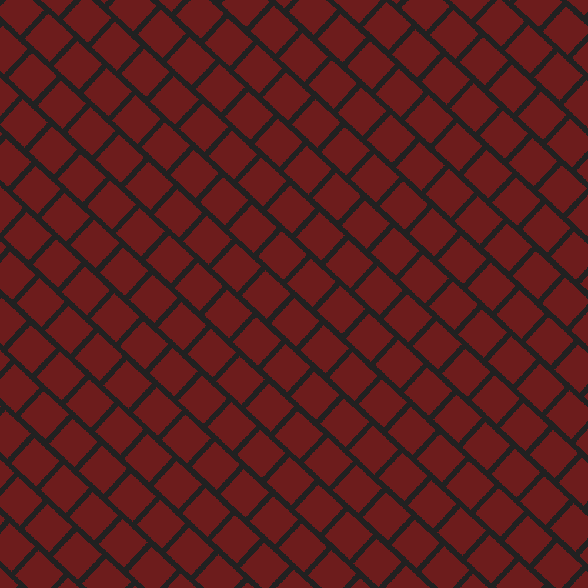
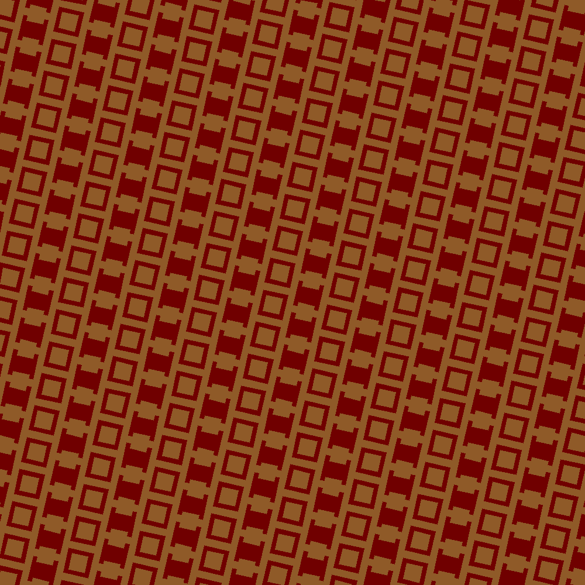
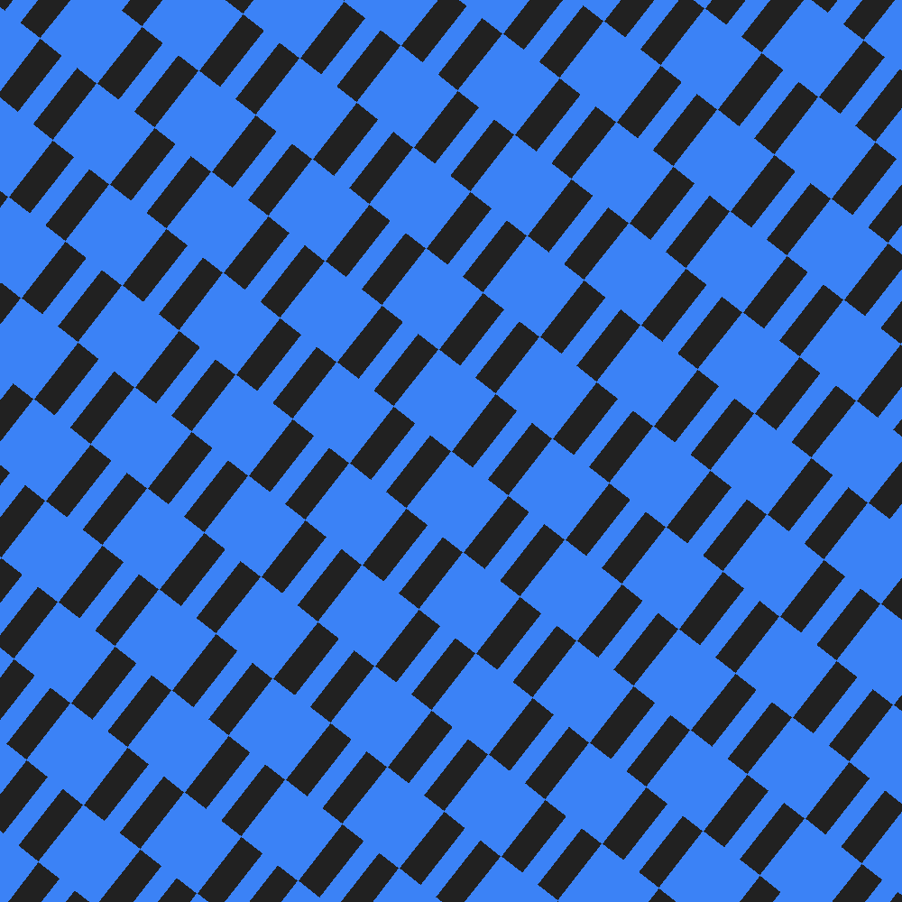
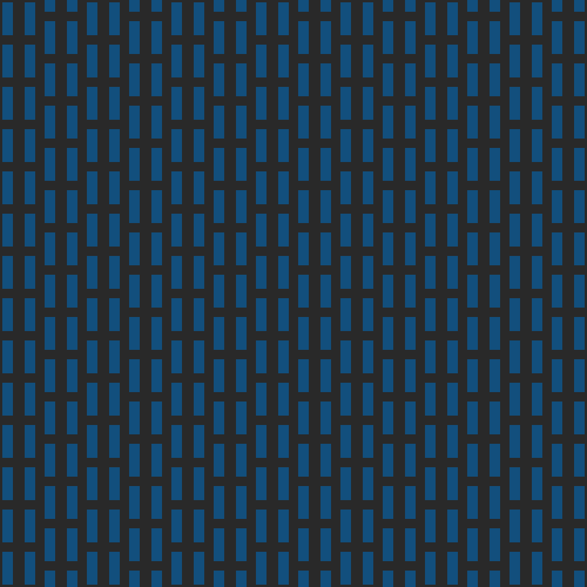
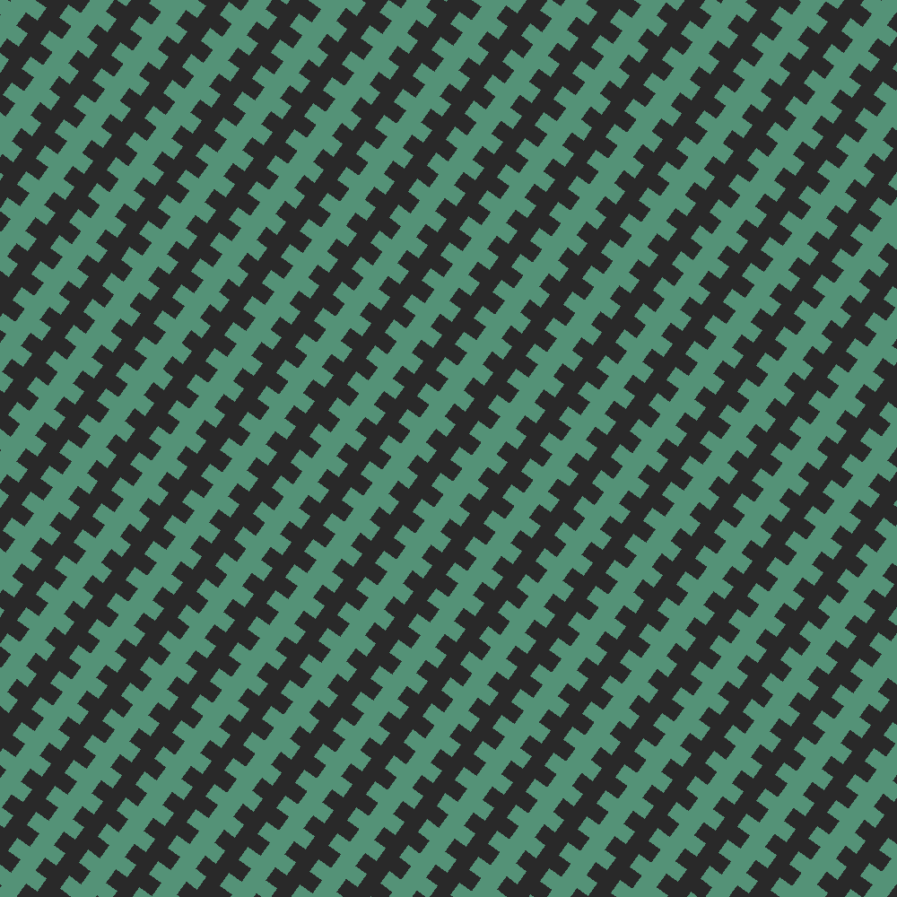
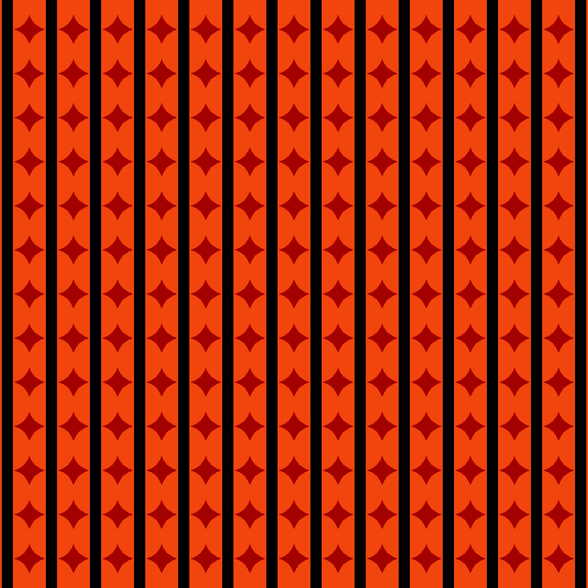

# Semiotic Pattern Builder

A browser-based tool for designing infinitely-tileable vector patterns.
---

<table>
  <tr>
    <td></td>
    <td></td>
    <td></td>
  </tr>
  <tr>
    <td></td>
    <td></td>
    <td></td>
  </tr>
</table>

## Files

| File | Purpose |
|---|---|
| `semiotic-pattern-builder.js` | The web component — all logic, styles, and rendering |
| `standalone.html` | Open this directly in a browser for the full tool |
| `embed-example.html` | Embedding demo: themes, combined/separated layouts, drag-resizable panes |
| `svg_to_image.py` | Convert `.svg` / `.smp` / `.json` patterns to PNG image files at any size |
| `semiotic_viewer.py` | Browse a `.json` collection, flicking between patterns |

## Embedding & view modes

The component supports a `view` attribute so you can split the UI across separate elements that stay in sync (they share state through the browser's storage events):

```html
<semiotic-pattern-builder view="panel"></semiotic-pattern-builder>
<semiotic-pattern-builder view="preview"></semiotic-pattern-builder>
<semiotic-pattern-builder view="collection"></semiotic-pattern-builder>
```

- `view="all"` (default) — controls, preview, and collection together
- `view="panel"` — just the controls
- `view="preview"` — just the live render
- `view="collection"` — just the thumbnails

Set a theme from markup or script:

```html
<semiotic-pattern-builder theme="blueprint"></semiotic-pattern-builder>
```
```js
document.querySelector('semiotic-pattern-builder').setTheme('terminal');
```

Built-in themes: `dark`, `light`, `warm`, `terminal`, `blueprint`, `paper`.

## Rendering patterns to PNG

```bash
# Single SVG -> PNG (default 1000x1000)
python3 svg_to_image.py pattern.svg

# Custom size
python3 svg_to_image.py pattern.svg --size 1920x1080 -o wallpaper.png

# JSON collection -> one PNG per pattern into ./out/
python3 svg_to_image.py patterns.json --size 800x800 --out ./out
```

It reads the embedded parameters and re-renders at the requested resolution (never upscales a small raster). Uses `cairosvg` if installed, otherwise falls back to a pure-Python `pillow` renderer; with neither it writes a resized `.svg`.

---

## Quick start

**As a standalone app** — open `standalone.html` in Chrome or Edge. No server, no install.

**Embedded in your own page:**

```html
<script src="semiotic-pattern-builder.js"></script>

<semiotic-pattern-builder style="display:block; width:100%; height:100vh">
</semiotic-pattern-builder>
```

The component fills its container. Size it however you like with CSS. Styles are scoped inside Shadow DOM and will not interfere with the rest of your page.

---

## How patterns are built

Each pattern has:

- A **background colour**
- A global **scale**, applied from the canvas centre
- A **Primary Layer** — always visible, one of: `checkerboard`, `circles`, `squares`, `stripes`
- A **Secondary Layer** — composited on top, same options plus `none`

Each layer has its own **rotation** (degrees, clockwise, about the canvas centre), so the two layers can be rotated independently — e.g. two stripe layers at 45° and 135° make a crosshatch.

### Tiling

All patterns tile infinitely using SVG `<pattern>` elements with `patternUnits="userSpaceOnUse"`. The tile repeats across the entire canvas without any edge or pixel boundary.

### Row offset / Col offset

These control **stagger** — shifting alternating rows or columns to create brick, herringbone, or offset grid effects.

- `row_offset 0.0` — grid aligned (no shift)
- `row_offset 0.5` — classic brick layout (every odd row shifted right by half the spacing)
- `row_offset 1.0` — same as 0.0 (full period)
- `col_offset` — same but shifts every odd column downward

The values are fractions of `spacing`, so they scale correctly when you change the spacing.

---

## File formats

### SVG (`.svg`)

Exported SVGs use a `1000×1000` viewBox with no fixed `width` or `height`, so they scale to any container. The rendering is pure vector — `<pattern>`, `<circle>`, and `<rect>` elements with no rasterisation.

Every exported SVG embeds the full pattern parameters inside a `<desc>` block in the `.smp` format (see below). This means:

- **Load it back** into the builder and all sliders are restored exactly
- **Open it in Illustrator or Figma** and it renders perfectly
- **Scale it to any size** in CSS or print — it stays crisp

### SMP (`.smp`) — Semiotic Pattern format

A plain-text key-value format. Human-readable, easy to parse in any language.

```
# semiotic-pattern/v1
# rotation is per-layer (degrees, clockwise, about the canvas centre).
# row_offset/col_offset: fraction of spacing shifted on every other row/column
# (0=none, 0.5=brick layout, 1.0=full period = same as 0)

schema         semiotic-pattern/v1
background     #121214
scale          1.0000

layer          1
type           circles
color          #3b82f6
size           24.0000
spacing        32.0000
rotation       0.0000
row_offset     0.5000
col_offset     0.0000

layer          2
type           none
color          #3b82f6
size           12.0000
spacing        24.0000
rotation       0.0000
row_offset     0.0000
col_offset     0.0000
```

Rules:
- A line whose first non-space character is `#` is a comment — skip it. (Don't strip from a mid-line `#`, or you'll cut off `#rrggbb` colours.)
- Each line is `key  value` separated by whitespace
- `layer N` marks the start of a layer block; all subsequent keys until the next `layer` belong to it
- Numbers are floats; colours are CSS hex strings

#### Python parser

```python
def parse_smp(text):
    params, layers, cur = {}, [], None
    for line in text.splitlines():
        line = line.strip()
        if not line or line[0] == '#':   # whole-line comments only — keeps #hex colours
            continue
        key, *rest = line.split()
        val = ' '.join(rest)
        def num(v):
            try: return float(v)
            except ValueError: return v
        if key == 'layer':
            cur = {}; layers.append(cur)
        elif cur is not None:
            cur[key] = num(val)
        else:
            params[key] = num(val)
    return params, layers
```

#### Drawing a pattern from SMP parameters

```python
# For each layer (where type != 'none'):
#
# 1. The tile is 2×spacing wide and 2×spacing tall.
#
# 2. Four shape centres in the tile (before ghosting):
#    A = (spacing/2,                spacing/2)
#    B = (spacing/2 + spacing,      spacing/2 + col_offset*spacing)
#    C = (spacing/2 + row_offset*spacing,  spacing/2 + spacing)
#    D = (spacing/2 + spacing + row_offset*spacing,  spacing/2 + spacing + col_offset*spacing)
#
# 3. For each centre, also place ghost copies at all 8 neighbour tile offsets
#    (±tileW, ±tileH) so shapes that cross a tile edge are complete.
#
# 4. Apply patternTransform: rotate around canvas centre, then scale around canvas centre.
#    transform = f"rotate({rotation} {cx} {cy}) translate({cx*(1-scale)} {cy*(1-scale)}) scale({scale})"
#
# Checkerboard is special: tile is 2sp×2sp, foreground fills top-left and bottom-right
# quadrants only. Secondary layer checkerboard skips the background fill so the
# primary layer shows through.
```

### JSON (`.json`)

The collection export saves all patterns as a JSON array. Each item is the raw state object:

```json
[
  {
    "bg": "#121214",
    "rotation": 0,
    "scale": 1,
    "s1": {
      "type": "circles",
      "color": "#3b82f6",
      "size": 24,
      "spacing": 32,
      "row_offset": 0.5,
      "col_offset": 0
    },
    "s2": {
      "type": "none",
      "color": "#3b82f6",
      "size": 12,
      "spacing": 24,
      "row_offset": 0,
      "col_offset": 0
    }
  }
]
```

Load this back into the builder with the **↑ Load** button, or reconstruct patterns programmatically using the drawing algorithm above.

---

## Browser support

- **Chrome / Edge** — full support including the folder picker (File System Access API)
- **Firefox / Safari** — full support except the folder picker; files download normally instead

---

## License

MIT
